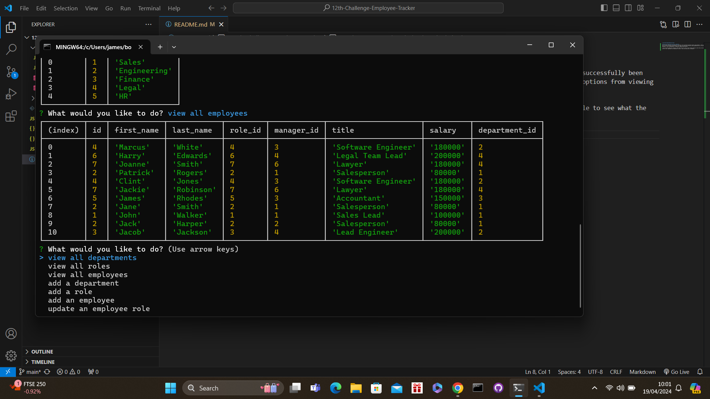

# 12th-Challenge-Employee-Tracker

## What was my task and what have i acheived?
In this weeks challenge i was tasked with creating a fully functional employee tracker using postgres. I have successfully been able to do this my ensuring that when the user starts the application they are then presented with all of the options from viewing employees, roles and departments to adding and updating each section.

I was also been tasked with creating a table when the user clicks on each viewing seection so that they are able to see what the current roles, departments and employees are which i have also been able to accomplish.

https://drive.google.com/file/d/1f8r1SCuE0aIujQQLiWFklx4xVPFRaX6d/view

